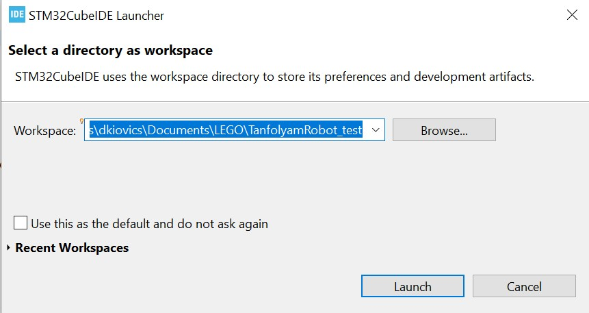
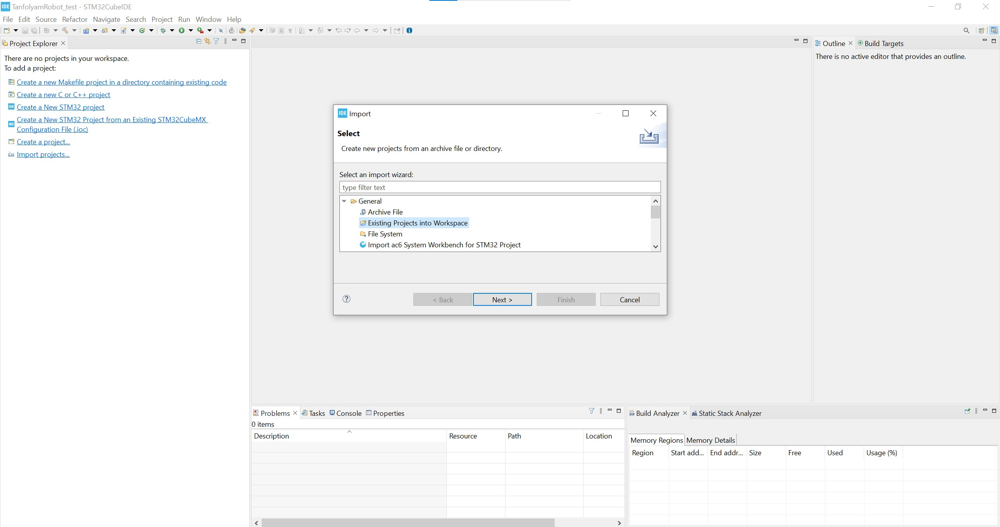
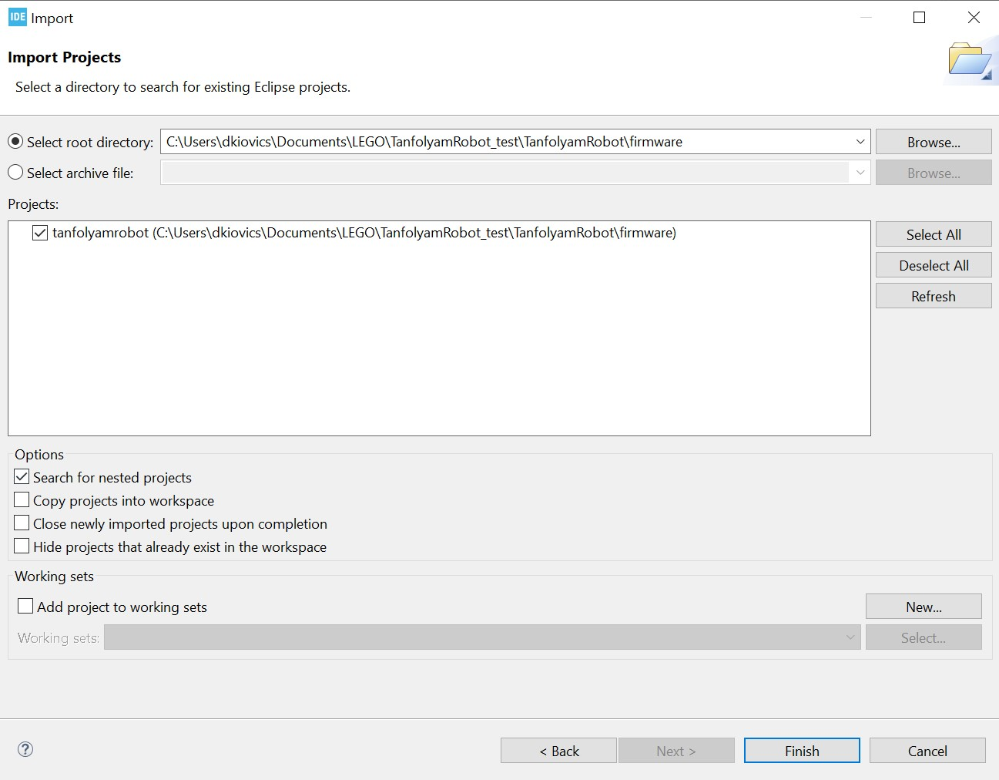
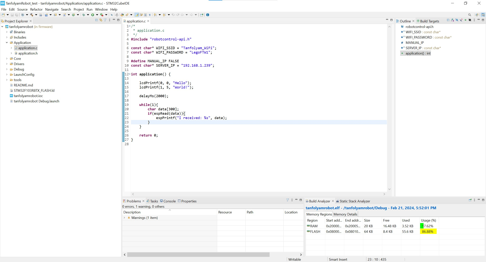
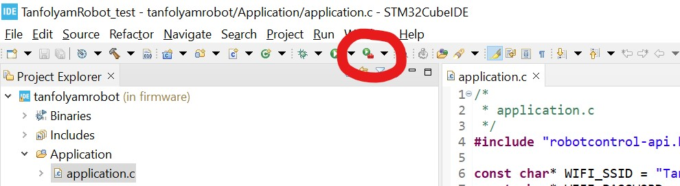
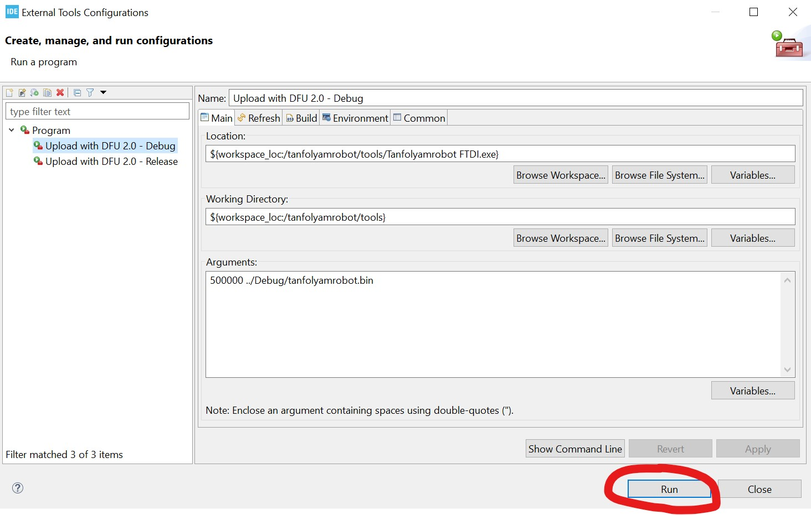

# LEGO Kör - TanfolyamRobot

## Fejlesztőkörnyezet

A firmware fejlesztéséhez az STM32CubeIDE fejlesztőkörnyezetet használjuk, mely regisztráció után letölthető az [STMicroelectronics weboldaláról](https://www.st.com/en/development-tools/stm32cubeide.html). ***FONTOS:*** figyeljünk arra, hogy letöltéskor az `1.10.1`-es verziót kell választani, máskülönben igen körülményes a projekt indítása!

Jelenleg erőforrások hiánya miatt sajnos csak Windows 10/11-en teszteljük a szoftvert. Más platformokon is valószínűleg működni fog, a feltöltő scriptet leszámítva.

## Robot illesztőszoftver

A robotra a firmware letöltése virtuális soros porton történik, a roboton az USB csatlakozó egy `FT232RL` chiphez kapcsolódik.

Előfordulhat, hogy a Windows nem telepíti automatikusan a virtuális soros port driverét. Ebben az esetben le kell töltenünk azt az [FTDI weboldaláról](https://ftdichip.com/wp-content/uploads/2021/08/CDM212364_Setup.zip), majd pedig kibontani és telepíteni.

## Kiinduló projekt letöltése, importálása

A kiinduló projektet a [GitHub repojából](https://github.com/legokor/TanfolyamRobot) tudjuk letölteni, ehhez az oldal megnyitása után jobb oldalt a `Releases` fül alatt kell kiválasztanunk a `firmware v2.0` nevű fájlt.

A letöltött fájlt helyezzük el egy kényelmes helyre, például `Documents/Lego Tanfolyam` mappába, majd bontsuk ki. Ezek után nyissuk meg a CubeIDE-t, ez először kérni fog tőlünk egy `workspace`-t. Válasszuk azt a mappát, amin belül található a TanfolyamRobot mappa. ***FONTOS:*** figyeljünk arra, hogy a `workspace`-nek választott mappán belül ez legyen az eredményül kapott fájlszerkezet: `./TanfolyamRobot/firmware/...`.

A CubeIDE-ben belül zárjuk be az indításkor megnyílt `Information Center` ablakot, majd importáljuk be a projektünket a következő módon: `File -> Import... -> General -> Existing Projects into Workspace -> Next`, a felugró ablakban pedig válasszuk ki a `Root directory`-ként a fentebb említett `firmware` mappát.

## Telemetria indítása

A robot különböző futásidejű adatait, debug üzeneteit egy webes felületen tudjuk nyomonkövetni. Ehhez mindössze annyit kell tennünk, hogy egy WiFi hálózatra csatlakozunk fel a robottal, majd pedig duplán klikkelünk a `TanfolyamRobot/start_telemetry.bat` fájlra. Ez utóbbit végezzük el egyszer otthon, mivel első alkalommal sok függőséget fog letölteni a script (miután ezzel megvagyunk és megnyílt a weboldal nyugodtan zárjuk be a megnyílt konzolokat és a weboldalt).

## *Csak a tanfolyamon kell:* projekt áttekintése, build és upload

Az imént megnyitott projektünk fájljait az IDE bal oldalán láthatjuk. A kód számunkra lényegi része a `tanfolyamrobot/Application/application.c` fájl lesz. Itt kell majd megoldanunk a tanfolyam során a feladatokat. Az itt található `application()` függvény gombnyomásra indul. Ha ebből a függvényből visszatér a programunk, akkor a robot leáll és a kijelzőn megjeleníti a visszatérési értéket.

Amennyiben ki szeretnénk próbálni az általunk írt kódot a roboton, úgy nyomjunk rá a CubeIDE tetején látható kis táskás zöld play gombra, a felnyíló ablakban pedig válasszuk ki az `Upload with DFU 2.0 - Debug` és nyomjunk rá a `Run` gombra (ezt a kiválasztást csak első alkalommal kell megcsinálnunk).

