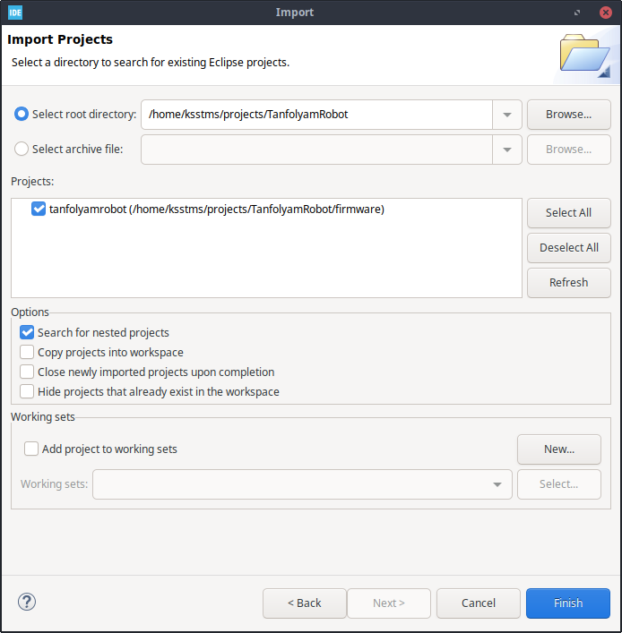
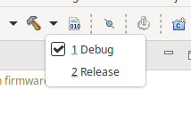
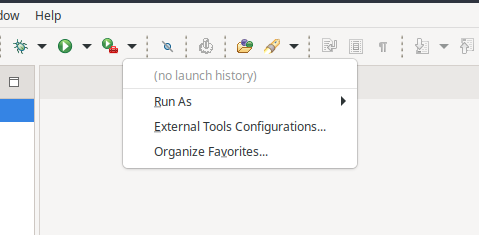
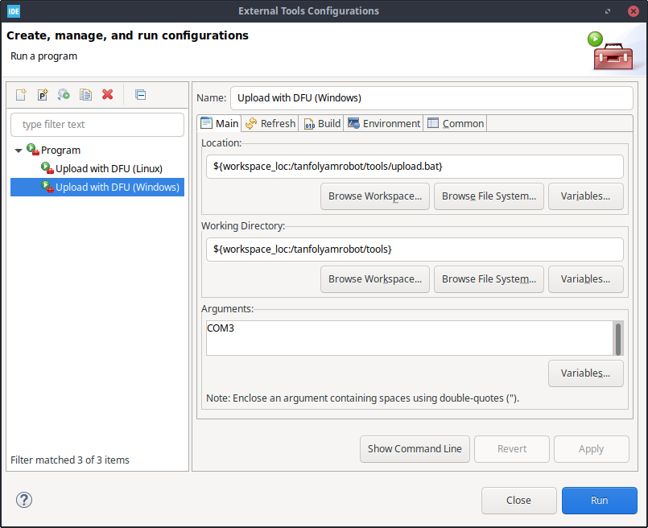

# LEGO Kör - TanfolyamRobot

## Fejlesztőkörnyezet

A firmware fejlesztéséhez az STM32CubeIDE fejlesztőkörnyezetet használjuk, mely regisztráció után letölthető az [STMicroelectronics weboldaláról](https://www.st.com/en/development-tools/stm32cubeide.html).

Tesztelt operációs rendszerek:
 * Windows 10
 * Ubuntu 18.04
 * Ubuntu 20.04
 * Pop!_OS 21.04

### További lépések Linux esetén
A firmware letöltése a robotra virtuális soros porton keresztül történik. A soros portok csak akkor használhatóak, ha a felhasználó tagja `dialout` csoportnak.

```
sudo adduser $USER dialout
```

Ezután oprendszertől függően ki és be kell jelentkezni, vagy újra kell indítani a gépet.


## Projekt importálása

GitHubon a [Releases](https://github.com/legokor/TanfolyamRobot/releases) alatt töltsük le a projekt aktuális verzióját, és csomagoljuk ki egy tetszőleges helyre.

Az STM32CubeIDE indításakor meg kell adnunk egy workspace mappát. Ez esetünkben teljesen mindegy, mert a projektet nem a workspace-ben tároljuk, hanem ott, ahova kicsomagoltuk. Maradhat default, és bepipálhatjuk, hogy legközelebb ne kérdezze meg.

Zárjuk be az `Information Center` tabot. A `File > Import...` ablakban válasszuk a `General > Existing Projects into Workspace` opciót.

A következő oldalon keressük ki a kicsomagolt projekt mappáját. Ekkor megjelenik egy `tanfolyamrobot` nevű projekt a listában. Fontos, hogy a `Copy projects into workspace` opció **NE** legyen kiválasztva.

<p align="center"></p>


## Fejlesztés

A tanfolyam során az `application.c` fájlban fogunk dolgozni. Az itt található `application()` függvény gombnyomásra indul. Ha ebből a függvényből visszatértek, a robot leáll, és a kijelzőn megjeleníti a viszzatérési értéket.

<p align="center"></p>

A letöltő program mindig a debug buildet tölti le, ezért fontos, hogy a toolbaron a kalapács melletti nyíl alatt ez legyen kiválasztva.

<p align="center"></p>

A letöltéshez be kell állítnunk a megfelelő soros portot. Ezt a képen látható `External Tools Configurations...` alatt tehetjük meg.

<p align="center"></p>

Válasszuk ki az operációs rendszernek megfelelő konfigurációt, majd az `Arguments` mezőben adjuk meg a használt soros portot. Ez Windows esetén pl. `COM3`, Linux esetén pedig `/dev/ttyUSB0`, vagy valami hasonló lesz.

Első letöltésnél ebben az ablakban kell a `Run` gombra kattintatni, utána a toolbaron a run external tool gomb (play gomb piros táskával) automatikusan ezt fogja futtatni.

<p align="center"></p>

