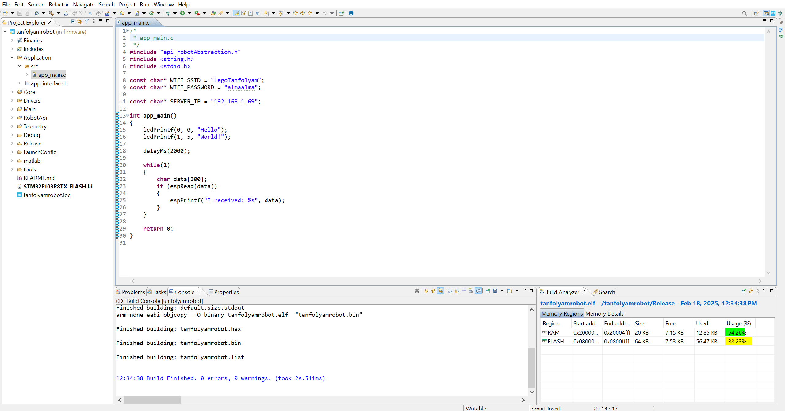
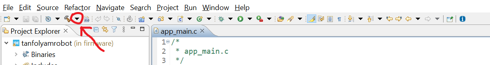
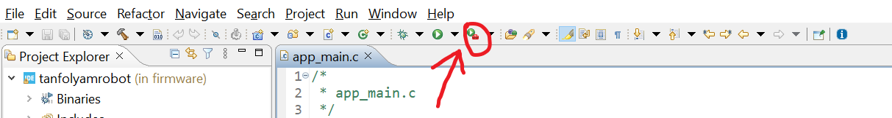
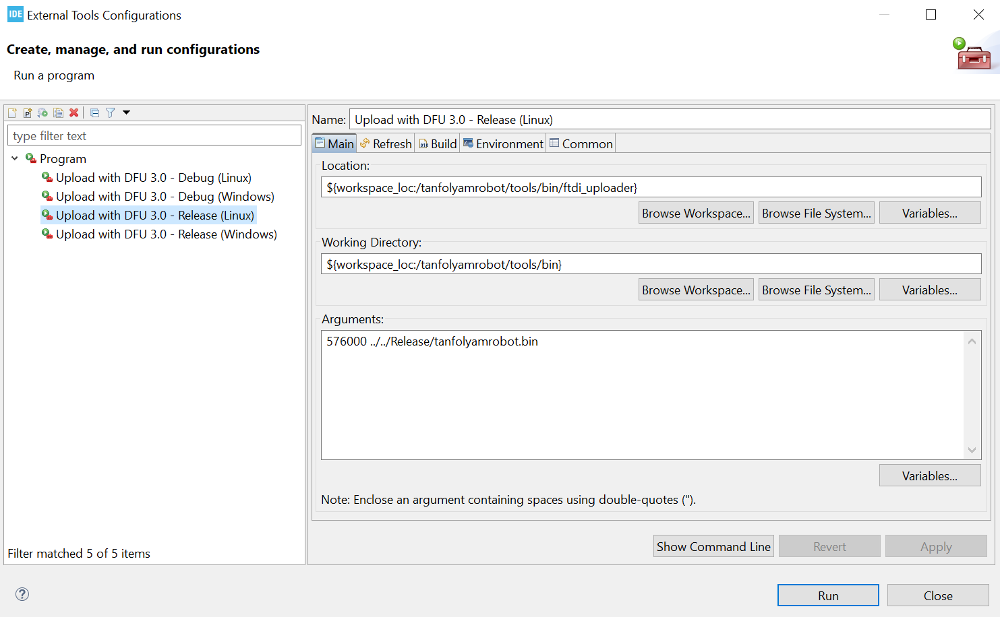

# LEGO Kör - TanfolyamRobot

## Fejlesztőkörnyezet

A firmware fejlesztéséhez az STM32CubeIDE fejlesztőkörnyezetet használjuk. Sajnos a letöltéshez regisztráció szükséges, ezért feltöltöttük a telepítő fájlokat [a körös drive-ra](https://drive.google.com/drive/folders/1UwxNlO1oCKLx6kzqNkejxS5eRtUtdVUO?usp=sharing), így regisztráció nélkül is telepíteni tudjátok - persze teljesen megértjük, ha nem akartok random drive-os fájlokat telepíteni, viszont ez esetben muszáj regisztrálnotok az [STMicroelectronics weboldalán](https://www.st.com/en/development-tools/stm32cubeide.html), és onnan letölteni.

Jelenleg Windows 10/11-en, Ubuntu-n és Fedora-n teszteljük a szoftvert. Más (Linux alapú) platformokon is valószínűleg működni fog - de ezt nem tudjuk garantálni.

## Robot illesztőszoftver

A robotra a firmware letöltése virtuális soros porton történik, a roboton az USB csatlakozó egy `FT232RL` chiphez kapcsolódik.

Előfordulhat, hogy a Windows nem telepíti automatikusan a virtuális soros port driverét. Ebben az esetben le kell töltenünk azt az [FTDI weboldaláról](https://ftdichip.com/wp-content/uploads/2021/08/CDM212364_Setup.zip), majd pedig kibontani és telepíteni.

## Kiinduló projekt letöltése, importálása

A kiinduló projektet a [GitHub repojából](https://github.com/legokor/TanfolyamRobot) tudjuk letölteni, ehhez az oldal megnyitása után jobb oldalt a `Releases` fül alatt kell kiválasztanunk a `firmware v3.0` nevű kiadást, majd a `tanfrobot.zip` fájlra kell kattintani.

A letöltött fájlt helyezzük el egy kényelmes helyre, például `Documents/Lego_Tanfolyam` mappába, majd bontsuk ki. Ezek után nyissuk meg a CubeIDE-t, ez először kérni fog tőlünk egy `workspace`-t. Válasszuk azt a mappát, amin belül található a TanfolyamRobot mappa. ***FONTOS:*** figyeljünk arra, hogy a `workspace`-nek választott mappán belül ez legyen az eredményül kapott fájlszerkezet: `./TanfolyamRobot/firmware/...` - itt a **kezdő "." jelöli a megnyitandó mappát**.

A CubeIDE-ben belül zárjuk be az indításkor megnyílt `Information Center` ablakot, majd importáljuk be a projektünket a következő módon: `File -> Import... -> General -> Existing Projects into Workspace -> Next`, a felugró ablakban pedig válasszuk ki a `Root directory`-ként a fentebb említett `firmware` mappát.

--------------------------------------------

--------------------------------------------

## *Csak a tanfolyamon kell:* projekt áttekintése, build és upload

Az imént megnyitott projektünk fájljait az IDE bal oldalán láthatjuk. A kód számunkra lényegi része a `tanfolyamrobot/Application/src/app_main.c` fájl lesz. Itt kell majd megoldanunk a tanfolyam során a feladatokat. Az itt található `app_main()` függvény gombnyomásra indul. Ha ebből a függvényből visszatér a programunk, akkor a robot leáll és a kijelzőn megjeleníti a visszatérési értéket.

A kód fordításához első alkalommal rá kell nyomni a toolbar-on lévő kis kalapács melletti nyilacskára, majd a legördülő menüben rá kell nyomni a `Release` gombra. A továbbiakban már elég csak magára a kalapácsra is rányomni.

Amennyiben ki szeretnénk próbálni az általunk írt kódot a roboton, úgy nyomjunk rá a CubeIDE tetején látható kis táskás zöld play gombra, a felnyíló ablakban pedig válasszuk ki az `Upload with DFU 3.0 - Release` (az operációs rendszerünknek megfelelően a Windows/Linux verziót kiválasztva) és nyomjunk rá a `Run` gombra - ezt a kiválasztást csak első alkalommal kell megcsinálnunk, utána már csak a zöld gombocskára kell rányomni. **FONTOS:** feltöltés előtt mindig fordítsátok le a kódotokat a kis kalapáccsal.

