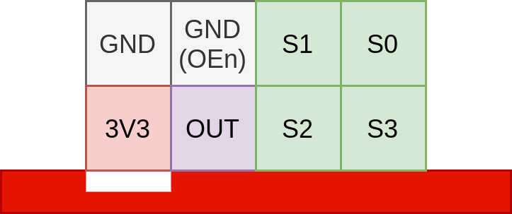

# TanfolyamRobot

## Connectors

The GND pin's location is marked on the board. The pins are in the same order as on the connected modules, **except for the encoders**, where the power pins are swapped.

| Color sensor                                       | Ultrasonic sensor                                | Motor encoders                                | Servo                                |
|----------------------------------------------------|--------------------------------------------------|-----------------------------------------------|--------------------------------------|
|  |  |  |  |
