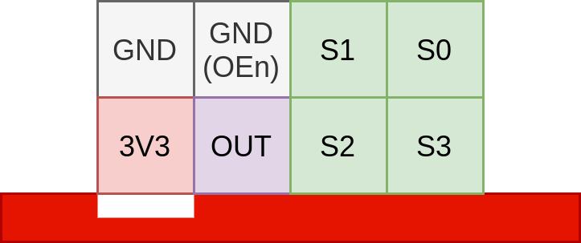
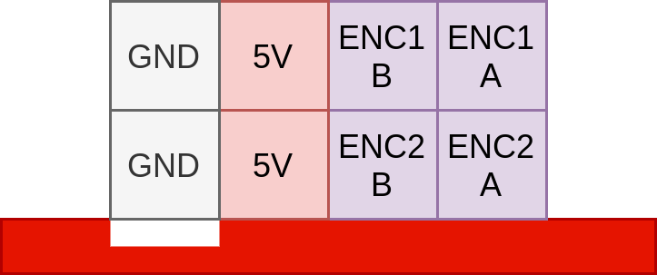
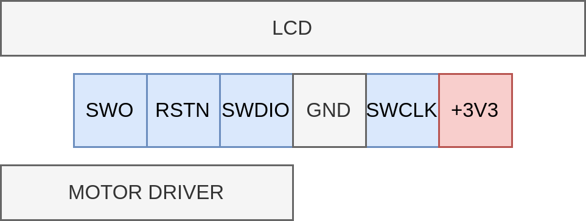
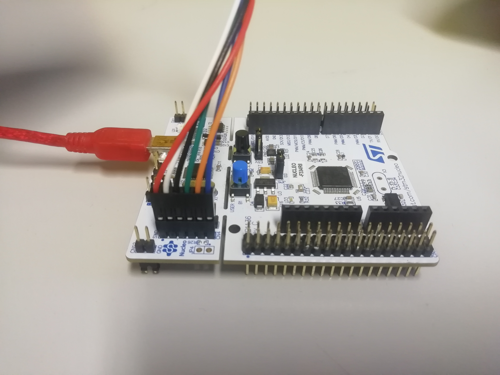
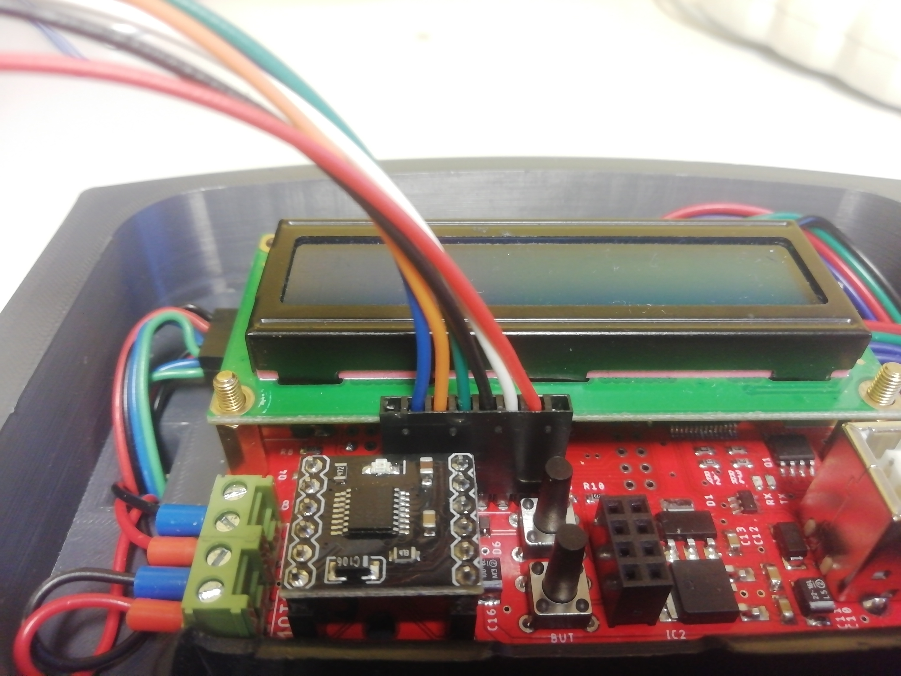
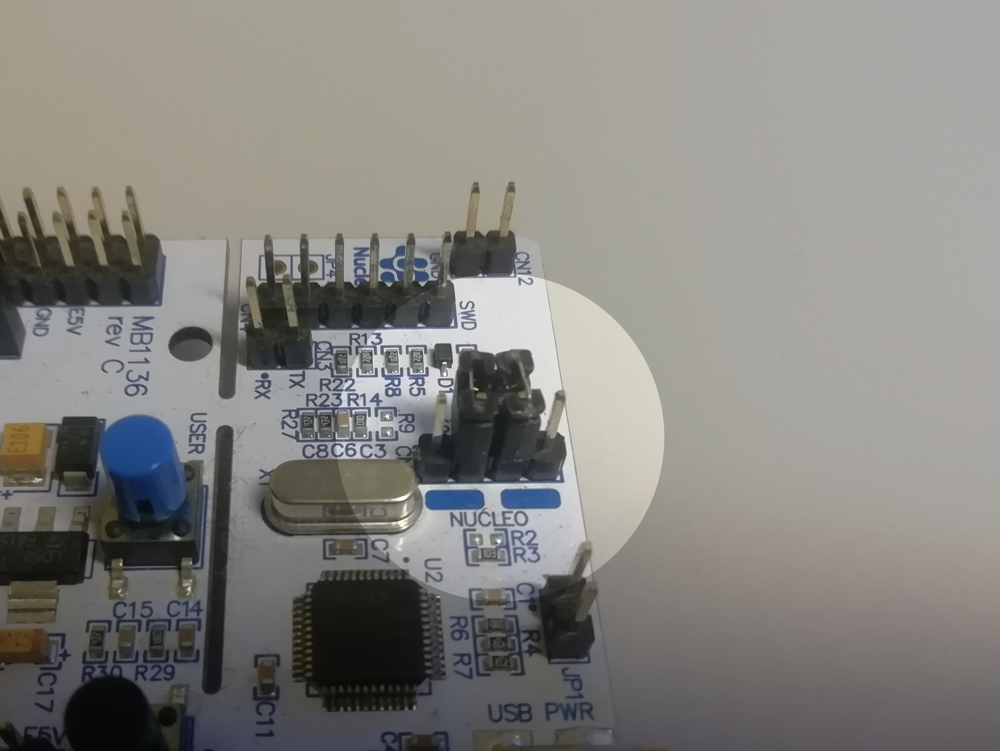
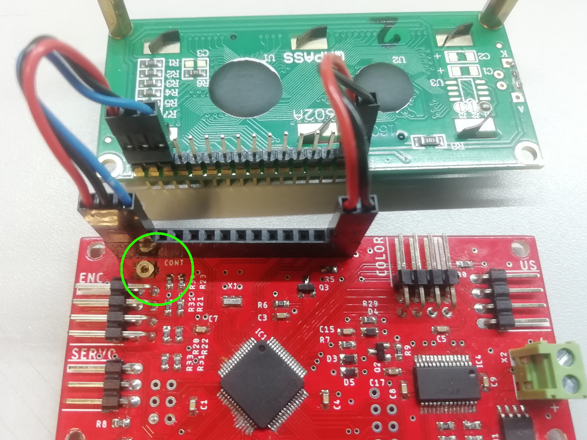

# Documentation

## Connectors

The GND pin's location is marked on the board. The pins are in the same order as on the connected modules, **except for the encoders**, where the power pins are swapped.

| Color sensor                                       | Ultrasonic sensor                                | Motor encoders                                | Servo                                |
|----------------------------------------------------|--------------------------------------------------|-----------------------------------------------|--------------------------------------|
|  |  |  |  |

## Debugging

The microcontroller has a Serial Wire Debug (SWD) interface, which can be used with an external debugger, like an ST-Link or the ST-Link part of a Nucleo development board. The SWD connector is located between the LCD and the motor driver module. It has the following pinout:

The pinout is the same as the STM Nucleo boards' SWD connector pinout, so it can be directly connected like this:

In order to use the ST-Link part of the Nucleo with an external microcontroller, the `CN2` jumpers have to be removed. You can put them on sideways so you don't lose them:

**Note: The debugger can not / should not power the board, so the batteries have to be connected!**

The STM32CubeIDE should automatically detect the ST-Link. Use the upload/debug buttons on the top bar to flash and/or debug the firmware.

## LCD contrast setting

The contrast potentiometer is under the LCD. Connect the power, contrast, and backlight pins (1, 2, 3, 15, 16) to the board using jumper cables. Power on the board, and turn the potentiometer until white boxes appear in the first row of the display.

