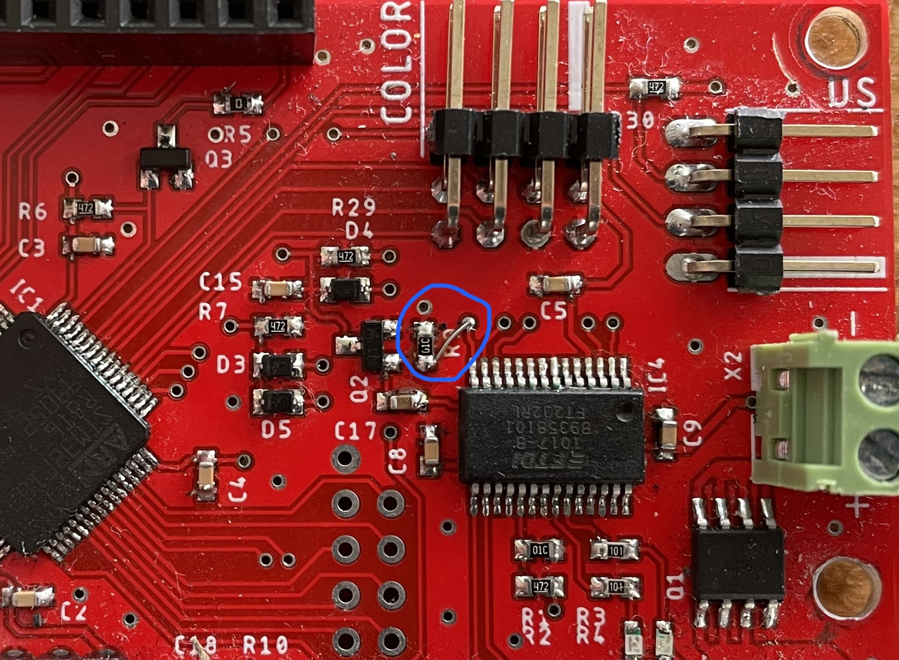

# New upload tool for Windows

## Overview

The program upload still happens through the built-in STM32 bootloader, only the way we make the STM32 enter bootloader mode has changed. In the new tool it is handled by the FT232RL chip, its configurable pins (CBUS2-3) force the STM32 into bootloader mode by controlling the RESET and BOOT0 pins.

## Necessary hardware modifications

Only two slight modifications are required:

- On the bottom of the PCB the CBUS2-BOOT0 connection needs to be bridged
- On the top of the PCB the CBUS3 line and the gate of Q2 needs to be connected (Q2 inverts the default low CBUS3 signal, this way the STM32 is not reset by default). The following image shows the completed modification

## FT232RL configuration

The FTDI chip needs to be configured so that CUBS2-3 are I/O pins. This can be done through the [official](https://ftdichip.com/utilities/#FT_PROG) FT PROG software utility by following these steps:

1. Connect the FT232RL
2. In the utility select `DEVICES` -> `Scan and Parse`
3. The detected device needs to appear
4. Select `Device` -> `FT EEPROM` -> `Hardware Specific` -> `IO Controls`
5. Set C3 and C4 to `IO MODE`
6. Click `DEVICES` -> `Program`

## STM32CubeIDE run configuration

There is a new run configuration in the IDE for this upload method (Upload with DFU 3.0 (Windows / Linux)). This configuration launches the `Tanfolyamrobot FTDI.exe` executable with the 3 given arguments: COM port, baud rate, binary path. The executable first resets and puts the STM32 into bootloader mode, then launches the stm32flash.exe, finally resets the STM32 again.